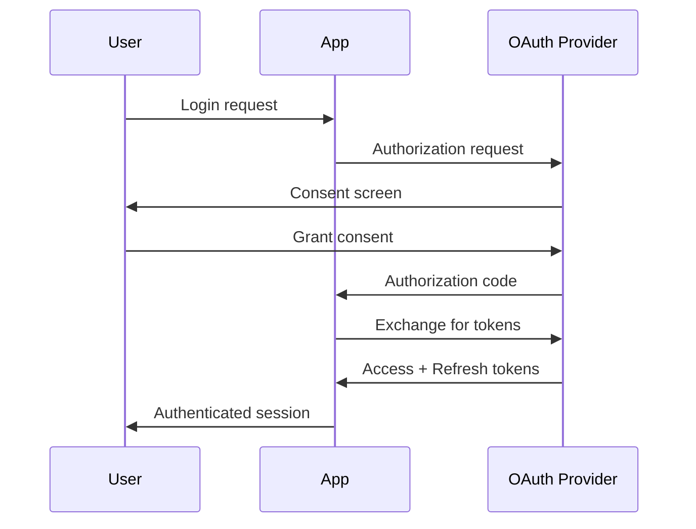

# GitHub PR Reviewer Implementation Plan

> Use superpowers:executing-plans to implement this plan task-by-task.

**Goal:** Create a GitHub Action + Plugin that provides multi-step, parallel AI code review with inline comments on PR diffs, CodeRabbit-style overview summaries, and configurable reviewer personas.

**Architecture:** A hybrid approach combining:

1. A **Plugin** (`packages/github-reviewer/`) that adds tools for diff retrieval and review submission
2. A **GitHub Action** that wraps OpenCode, loads our plugin, and provides review-specific prompts
3. **Parallel reviewers** using `Promise.allSettled()` pattern from our code-review package
4. **Diff position mapping** to convert file line numbers to GitHub API positions

**Tech Stack:** TypeScript, Bun, Zod (config validation), @octokit/rest (GitHub API), parse-diff (diff parsing), @opencode-ai/plugin (tool definition)

---

## Design Decisions

| Aspect                   | Decision                                                                    |
| ------------------------ | --------------------------------------------------------------------------- |
| **Trigger**              | Configurable: automatic on PR events OR on-demand via `/review` command     |
| **Config location**      | `owo.json` with workflow override support                                   |
| **Reviewer parallelism** | Parallel execution with `Promise.allSettled()`                              |
| **Reviewer personas**    | Configurable prompts per reviewer, default "Helpful Peer"                   |
| **Diff source**          | `git diff base...head` parsed with `parse-diff` library                     |
| **Inline comments**      | Map file:line to diff position, fallback to overview for non-diff lines     |
| **Overview format**      | CodeRabbit-style: Summary, Changes table, Walkthrough, Diagram, Fun comment |
| **Review actions**       | MVP: COMMENT only. Future: APPROVE/REQUEST_CHANGES                          |

---

## Config Schema

Uses existing `ContextSchema` pattern from `@owo/config` for prompts (supports inline strings or file references).
Adds model configuration following OpenCode's `provider/model` format with optional `variant` for thinking level.

```json
{
  "github-review": {
    "enabled": true,
    "trigger": "command",
    "mentions": ["/review", "/oc-review"],
    "reviewers": [
      {
        "name": "security",
        "context": [{ "file": "prompts/security-reviewer.md" }],
        "focus": "security vulnerabilities and auth issues",
        "model": "anthropic/claude-sonnet-4-5",
        "variant": "high"
      },
      {
        "name": "quality",
        "context": [
          "You are a helpful peer reviewer. Focus on code quality, readability, and best practices."
        ],
        "focus": "code quality"
      }
    ],
    "overview": {
      "context": [{ "file": "prompts/overview-synthesizer.md" }],
      "model": "anthropic/claude-sonnet-4-5",
      "includeDiagram": true,
      "includeTable": true
    },
    "defaults": {
      "model": "anthropic/claude-sonnet-4-5",
      "variant": "default"
    }
  }
}
```

**Context examples:**

- Inline: `"context": ["You are a security expert..."]`
- File: `"context": [{ "file": "prompts/security.md" }]`
- Mixed: `"context": ["Base instructions", { "file": "detailed-rules.md" }]`

**Model format:** `provider/model` (e.g., `anthropic/claude-sonnet-4-5`, `openai/gpt-4o`, `opencode/glm-4-7`)

**Variant:** Thinking level - `"low"`, `"default"`, `"high"` (provider-specific)

---

## Tool Interfaces

### Tool 1: `get_pr_context`

```typescript
get_pr_context({
  include_diff: boolean, // Include full unified diff
  include_files: boolean, // Include file list with stats
})
```

**Returns:** JSON with PR metadata, diff content, and file list.

### Tool 2: `submit_review`

```typescript
submit_review({
  overview: string, // Markdown overview comment
  comments: Array<{
    path: string // File path
    line: number // Line number in NEW file
    body: string // Comment content
    side: "LEFT" | "RIGHT" // Which side of diff (default RIGHT)
  }>,
  event: "COMMENT", // MVP: only COMMENT. Future: APPROVE | REQUEST_CHANGES
})
```

**Returns:** Success message with review URL.

---

## Architecture Diagram

```
┌─────────────────────────────────────────────────────────────────────┐
│                         GitHub PR Event                              │
│              (pull_request.opened / issue_comment /review)           │
└─────────────────────────────────────────────────────────────────────┘
                                    │
                                    ▼
┌─────────────────────────────────────────────────────────────────────┐
│                    owo-reviewer GitHub Action                        │
│  ┌─────────────────────────────────────────────────────────────┐    │
│  │  1. Checkout repo                                            │    │
│  │  2. Install opencode + owo-reviewer plugin                   │    │
│  │  3. Run: opencode github run --prompt "Review this PR..."    │    │
│  └─────────────────────────────────────────────────────────────┘    │
└─────────────────────────────────────────────────────────────────────┘
                                    │
                                    ▼
┌─────────────────────────────────────────────────────────────────────┐
│                     OpenCode Agent Session                           │
│  ┌─────────────────────────────────────────────────────────────┐    │
│  │  Agent receives prompt + tools from plugin                   │    │
│  │  1. Calls get_pr_context() to get diff                       │    │
│  │  2. Analyzes code with configured persona                    │    │
│  │  3. Calls submit_review() with findings                      │    │
│  └─────────────────────────────────────────────────────────────┘    │
└─────────────────────────────────────────────────────────────────────┘
                                    │
                                    ▼
┌─────────────────────────────────────────────────────────────────────┐
│                    github-reviewer Plugin                            │
│  ┌───────────────────┐    ┌───────────────────┐                     │
│  │  get_pr_context   │    │   submit_review   │                     │
│  │      (Tool)       │    │      (Tool)       │                     │
│  └───────────────────┘    └───────────────────┘                     │
│           │                        │                                 │
│           ▼                        ▼                                 │
│  • Runs git diff              • Parses diff for positions           │
│  • Fetches PR metadata        • Maps line → position                │
│  • Returns JSON context       • Batches inline comments             │
│                               • Posts via GitHub API                │
│                               • Falls back to overview for          │
│                                 non-diff lines                      │
└─────────────────────────────────────────────────────────────────────┘
                                    │
                                    ▼
┌─────────────────────────────────────────────────────────────────────┐
│                        GitHub PR Review                              │
│  ┌─────────────────────────────────────────────────────────────┐    │
│  │  Overview Comment (CodeRabbit-style):                        │    │
│  │  • Summary                                                   │    │
│  │  • Changes Table                                             │    │
│  │  • Walkthrough                                               │    │
│  │  • Mermaid Diagram                                           │    │
│  │  • Fun closing comment                                       │    │
│  └─────────────────────────────────────────────────────────────┘    │
│  ┌─────────────────────────────────────────────────────────────┐    │
│  │  Inline Comments:                                            │    │
│  │  • Positioned on specific diff lines                         │    │
│  │  • With code suggestions                                     │    │
│  └─────────────────────────────────────────────────────────────┘    │
└─────────────────────────────────────────────────────────────────────┘
```

---

## Multi-Reviewer Flow (Phase 3)

```
┌─────────────────────────────────────────────────────────────────────┐
│                      Parallel Review Dispatch                        │
└─────────────────────────────────────────────────────────────────────┘
                                    │
                    ┌───────────────┼───────────────┐
                    ▼               ▼               ▼
            ┌───────────┐   ┌───────────┐   ┌───────────┐
            │ Reviewer 1│   │ Reviewer 2│   │ Reviewer N│
            │ (Security)│   │ (Quality) │   │ (Custom)  │
            └───────────┘   └───────────┘   └───────────┘
                    │               │               │
                    └───────────────┼───────────────┘
                                    ▼
            ┌─────────────────────────────────────────────┐
            │           Promise.allSettled()              │
            │  Collect all reviewer outputs (fault-tolerant)│
            └─────────────────────────────────────────────┘
                                    │
                                    ▼
            ┌─────────────────────────────────────────────┐
            │              Overview Synthesizer            │
            │  Combines findings into CodeRabbit format   │
            └─────────────────────────────────────────────┘
                                    │
                                    ▼
            ┌─────────────────────────────────────────────┐
            │              submit_review()                 │
            │  Posts overview + all inline comments       │
            └─────────────────────────────────────────────┘
```

---

## Output Format (CodeRabbit-style)

````markdown
<!-- Auto-generated by owo-reviewer -->

## 📋 Summary

This PR introduces OAuth2 authentication support, replacing the legacy session-based auth.
The changes are well-structured but have a few security considerations noted below.

## 📁 Changes

| File                     | Type        | Summary                          |
| ------------------------ | ----------- | -------------------------------- |
| `src/auth/oauth.ts`      | ✨ Added    | New OAuth2 client implementation |
| `src/auth/session.ts`    | 🔄 Modified | Deprecated legacy methods        |
| `src/middleware/auth.ts` | 🔄 Modified | Updated to use new auth flow     |
| `tests/auth.test.ts`     | ✅ Added    | Test coverage for OAuth2         |

## 🔍 Walkthrough

### `src/auth/oauth.ts`

New OAuth2 client with support for authorization code flow. Implements token refresh
and secure storage. Uses PKCE for enhanced security.

### `src/auth/session.ts`

Legacy session methods marked as deprecated. Migration path documented in comments.

<details>
<summary>📊 Architecture Diagram</summary>


````

</details>

## 💬 Reviewer Notes

**Security Reviewer** 🔒: The PKCE implementation looks solid! Consider adding rate
limiting on the token endpoint to prevent brute-force attacks.

**Quality Reviewer** ✨: Clean separation of concerns. The deprecated methods have
clear migration paths. Nice work!

---

_Reviewed by [owo-reviewer](https://github.com/jmagar/owo) • 2 reviewers • 4 inline comments_

````

---

## Implementation Phases

### Phase 1: MVP - Basic Inline Comments + Overview ⭐ (Current Target)

**Scope:**
- Single reviewer (no parallel yet)
- `get_pr_context` tool
- `submit_review` tool with position mapping
- Hardcoded CodeRabbit-style overview template
- COMMENT event only

**Deliverables:**
- `packages/github-reviewer/` package
- Basic plugin with two tools
- GitHub Action wrapper
- Working end-to-end flow

### Phase 2: Formal Review Actions

**Scope:**
- Add APPROVE and REQUEST_CHANGES events
- Configurable review action based on findings severity
- Auto-approve for clean reviews (optional)

### Phase 3: Multi-Reviewer Parallel Execution

**Scope:**
- Parallel reviewer dispatch with `Promise.allSettled()`
- Configurable reviewer personas/prompts
- Synthesizer to combine findings
- Fault-tolerant (one reviewer failure doesn't block others)

### Phase 4: Advanced Formatting & Diagrams

**Scope:**
- Mermaid diagram generation
- Configurable output templates
- Custom emoji/tone settings
- Integration with existing code-review package patterns

---

## Tasks

### Task 1: Create Package Structure

**Files:**
- Create: `packages/github-reviewer/package.json`
- Create: `packages/github-reviewer/tsconfig.json`
- Create: `packages/github-reviewer/src/index.ts`

**Step 1: Create package.json**

Note best to use bun to install these, which will get the latest versions

```json
{
  "$schema": "https://json.schemastore.org/package.json",
  "name": "@owo/github-reviewer",
  "version": "0.0.1",
  "type": "module",
  "license": "MIT",
  "scripts": {
    "build": "bun build ./src/index.ts --outdir ./dist --target node --format esm --external '@opencode-ai/*' --external 'zod' --external '@octokit/*' --external 'parse-diff'",
    "typecheck": "tsc --noEmit",
    "clean": "rm -rf dist"
  },
  "exports": {
    ".": "./src/index.ts"
  },
  "files": ["dist"],
  "dependencies": {
    "@octokit/rest": "21.0.0",
    "parse-diff": "0.11.1",
    "zod": "catalog:"
  },
  "devDependencies": {
    "@opencode-ai/plugin": "1.1.35",
    "@opencode-ai/sdk": "0.1.0",
    "@tsconfig/node22": "catalog:",
    "@types/node": "catalog:",
    "typescript": "catalog:"
  },
  "peerDependencies": {
    "@opencode-ai/plugin": "1.0.0"
  }
}
````

**Step 2: Create tsconfig.json**

```json
{
  "extends": "@tsconfig/node22/tsconfig.json",
  "compilerOptions": {
    "outDir": "./dist",
    "rootDir": "./src",
    "declaration": true,
    "declarationMap": true,
    "strict": true,
    "noEmit": true
  },
  "include": ["src/**/*"],
  "exclude": ["node_modules", "dist"]
}
```

**Step 3: Create minimal index.ts**

```typescript
import type { Plugin } from "@opencode-ai/plugin"

export const GitHubReviewerPlugin: Plugin = async (ctx) => {
  console.log("[github-reviewer] Plugin loaded")

  return {
    tool: {
      // Tools will be added in subsequent tasks
    },
  }
}

export default GitHubReviewerPlugin
```

**Step 4: Add to workspace**

Update root `package.json` workspaces array to include `"packages/github-reviewer"`.

**Step 5: Install dependencies**

Run: `bun install`
Expected: Dependencies installed successfully

**Step 6: Verify typecheck**

Run: `bun run typecheck`
Working directory: `packages/github-reviewer`
Expected: PASS

**Step 7: Commit**

```bash
git add packages/github-reviewer/ package.json bun.lock
git commit -m "feat(github-reviewer): create package structure"
```

---

### Task 2: Implement GitHub Context Utilities

**Files:**

- Create: `packages/github-reviewer/src/github.ts`
- Create: `packages/github-reviewer/src/types.ts`

**Step 1: Create types.ts**

```typescript
import { z } from "zod"

/**
 * PR metadata from GitHub context
 */
export type PRContext = {
  owner: string
  repo: string
  number: number
  baseSha: string
  headSha: string
  baseRef: string
  headRef: string
  title: string
  body: string
  author: string
}

/**
 * File change information
 */
export type FileChange = {
  path: string
  status: "added" | "modified" | "removed" | "renamed"
  additions: number
  deletions: number
  patch?: string
}

/**
 * Inline comment to post
 */
export const InlineCommentSchema = z.object({
  path: z.string().describe("File path relative to repo root"),
  line: z.number().describe("Line number in the NEW version of the file"),
  body: z.string().describe("Comment content (markdown supported)"),
  side: z.enum(["LEFT", "RIGHT"]).default("RIGHT").describe("Which side of diff"),
})

export type InlineComment = z.infer<typeof InlineCommentSchema>

/**
 * Review submission input
 */
export const ReviewInputSchema = z.object({
  overview: z.string().describe("Markdown overview comment for the PR"),
  comments: z.array(InlineCommentSchema).default([]).describe("Inline comments on specific lines"),
  event: z.enum(["COMMENT", "APPROVE", "REQUEST_CHANGES"]).default("COMMENT"),
})

export type ReviewInput = z.infer<typeof ReviewInputSchema>

/**
 * Diff position mapping result
 */
export type PositionMapping = {
  path: string
  line: number
  position: number | null // null if line not in diff
  side: "LEFT" | "RIGHT"
}
```

**Step 2: Create github.ts**

```typescript
import { Octokit } from "@octokit/rest"
import parseDiff from "parse-diff"
import type { PRContext, FileChange, InlineComment, PositionMapping } from "./types"

/**
 * Get GitHub token from environment
 */
export function getGitHubToken(): string {
  const token = process.env.GITHUB_TOKEN
  if (!token) {
    throw new Error("GITHUB_TOKEN environment variable is required")
  }
  return token
}

/**
 * Parse GitHub context from environment (set by GitHub Actions)
 */
export function getPRContext(): PRContext | null {
  const eventPath = process.env.GITHUB_EVENT_PATH
  if (!eventPath) return null

  try {
    const event = require(eventPath)
    const pr = event.pull_request
    if (!pr) return null

    const [owner, repo] = (process.env.GITHUB_REPOSITORY || "").split("/")

    return {
      owner,
      repo,
      number: pr.number,
      baseSha: pr.base.sha,
      headSha: pr.head.sha,
      baseRef: pr.base.ref,
      headRef: pr.head.ref,
      title: pr.title,
      body: pr.body || "",
      author: pr.user.login,
    }
  } catch {
    return null
  }
}

/**
 * Get PR context from environment or throw
 */
export function requirePRContext(): PRContext {
  const ctx = getPRContext()
  if (!ctx) {
    throw new Error("Not running in a PR context. GITHUB_EVENT_PATH not set or not a PR event.")
  }
  return ctx
}

/**
 * Create Octokit client with token from environment
 */
export function createOctokit(): Octokit {
  return new Octokit({ auth: getGitHubToken() })
}

/**
 * Map a file line number to a diff position
 *
 * GitHub API requires "position" which is the line number within the diff hunk,
 * NOT the actual file line number. This function parses the diff and finds
 * the correct position.
 *
 * @param diffContent - Raw unified diff content
 * @param filePath - Path to the file
 * @param lineNumber - Line number in the NEW version of the file
 * @param side - Which side of the diff (LEFT = old, RIGHT = new)
 * @returns Position in diff, or null if line is not in the diff
 */
export function mapLineToPosition(
  diffContent: string,
  filePath: string,
  lineNumber: number,
  side: "LEFT" | "RIGHT" = "RIGHT",
): number | null {
  const files = parseDiff(diffContent)

  // Find the file in the diff
  const file = files.find((f) => {
    const toPath = f.to?.replace(/^b\//, "")
    const fromPath = f.from?.replace(/^a\//, "")
    return toPath === filePath || fromPath === filePath
  })

  if (!file) return null

  let position = 0

  for (const chunk of file.chunks) {
    for (const change of chunk.changes) {
      position++

      // Match based on side
      if (side === "RIGHT") {
        // New file line numbers (additions and context)
        if ((change.type === "add" || change.type === "normal") && "ln2" in change) {
          if (change.ln2 === lineNumber) return position
        }
      } else {
        // Old file line numbers (deletions and context)
        if ((change.type === "del" || change.type === "normal") && "ln1" in change) {
          if (change.ln1 === lineNumber) return position
        }
      }
    }
  }

  return null // Line not found in diff
}

/**
 * Map multiple comments to their diff positions
 * Returns comments with positions, and a list of comments that couldn't be mapped
 */
export function mapCommentsToPositions(
  diffContent: string,
  comments: InlineComment[],
): { mapped: Array<InlineComment & { position: number }>; unmapped: InlineComment[] } {
  const mapped: Array<InlineComment & { position: number }> = []
  const unmapped: InlineComment[] = []

  for (const comment of comments) {
    const position = mapLineToPosition(diffContent, comment.path, comment.line, comment.side)

    if (position !== null) {
      mapped.push({ ...comment, position })
    } else {
      unmapped.push(comment)
    }
  }

  return { mapped, unmapped }
}

/**
 * Format unmapped comments for inclusion in overview
 */
export function formatUnmappedComments(unmapped: InlineComment[]): string {
  if (unmapped.length === 0) return ""

  const lines = [
    "",
    "## 📝 Additional Notes",
    "",
    "*The following comments are for lines not in the current diff:*",
    "",
  ]

  for (const comment of unmapped) {
    lines.push(`### \`${comment.path}:${comment.line}\``)
    lines.push("")
    lines.push(comment.body)
    lines.push("")
  }

  return lines.join("\n")
}
```

**Step 3: Run typecheck**

Run: `bun run typecheck`
Working directory: `packages/github-reviewer`
Expected: PASS

**Step 4: Commit**

```bash
git add packages/github-reviewer/src/
git commit -m "feat(github-reviewer): add GitHub context utilities and types"
```

---

### Task 3: Implement get_pr_context Tool

**Files:**

- Create: `packages/github-reviewer/src/tools/get-pr-context.ts`
- Modify: `packages/github-reviewer/src/index.ts`

**Step 1: Create get-pr-context.ts**

```typescript
import { tool } from "@opencode-ai/plugin"
import { $ } from "bun"
import { requirePRContext, createOctokit } from "../github"
import type { FileChange } from "../types"

export const getPRContextTool = tool({
  description: `Get PR context including diff and file changes for code review.
Returns JSON with PR metadata, the unified diff, and a list of changed files.
Use this to understand what changes are being reviewed before analyzing them.`,
  args: {
    include_diff: tool.schema
      .boolean()
      .default(true)
      .describe("Include the full unified diff content"),
    include_files: tool.schema
      .boolean()
      .default(true)
      .describe("Include list of changed files with stats"),
  },
  async execute(args) {
    const ctx = requirePRContext()
    const octokit = createOctokit()

    const result: {
      pr: typeof ctx
      diff?: string
      files?: FileChange[]
    } = { pr: ctx }

    // Get diff using git
    if (args.include_diff) {
      try {
        const diffResult = await $`git diff ${ctx.baseSha}...${ctx.headSha}`.text()
        result.diff = diffResult
      } catch (err) {
        // Fallback: fetch more history and try again
        await $`git fetch origin ${ctx.baseRef} --depth=100`.quiet()
        const diffResult = await $`git diff ${ctx.baseSha}...${ctx.headSha}`.text()
        result.diff = diffResult
      }
    }

    // Get file list from GitHub API
    if (args.include_files) {
      const { data: files } = await octokit.rest.pulls.listFiles({
        owner: ctx.owner,
        repo: ctx.repo,
        pull_number: ctx.number,
        per_page: 100,
      })

      result.files = files.map((f) => ({
        path: f.filename,
        status: f.status as FileChange["status"],
        additions: f.additions,
        deletions: f.deletions,
        patch: f.patch,
      }))
    }

    return JSON.stringify(result, null, 2)
  },
})
```

**Step 2: Update index.ts to export tool**

```typescript
import type { Plugin } from "@opencode-ai/plugin"
import { getPRContextTool } from "./tools/get-pr-context"

export const GitHubReviewerPlugin: Plugin = async (ctx) => {
  console.log("[github-reviewer] Plugin loaded")

  return {
    tool: {
      get_pr_context: getPRContextTool,
    },
  }
}

export default GitHubReviewerPlugin
```

**Step 3: Run typecheck**

Run: `bun run typecheck`
Working directory: `packages/github-reviewer`
Expected: PASS

**Step 4: Commit**

```bash
git add packages/github-reviewer/src/
git commit -m "feat(github-reviewer): implement get_pr_context tool"
```

---

### Task 4: Implement submit_review Tool

**Files:**

- Create: `packages/github-reviewer/src/tools/submit-review.ts`
- Modify: `packages/github-reviewer/src/index.ts`

**Step 1: Create submit-review.ts**

```typescript
import { tool } from "@opencode-ai/plugin"
import { $ } from "bun"
import {
  requirePRContext,
  createOctokit,
  mapCommentsToPositions,
  formatUnmappedComments,
} from "../github"
import { InlineCommentSchema } from "../types"

export const submitReviewTool = tool({
  description: `Submit a code review with an overview comment and inline comments on specific lines.

IMPORTANT: Inline comments can only be placed on lines that are part of the diff.
If you want to comment on a line that's not in the diff, include it in the overview instead.

The tool will automatically:
1. Map your line numbers to GitHub's diff positions
2. Move any comments on non-diff lines to the overview
3. Post the review via GitHub API`,
  args: {
    overview: tool.schema
      .string()
      .describe(
        "Markdown overview comment summarizing the review. Will appear at the top of the review.",
      ),
    comments: tool.schema
      .array(InlineCommentSchema)
      .default([])
      .describe(
        "Inline comments on specific lines. Each needs path, line number, and comment body.",
      ),
    event: tool.schema
      .enum(["COMMENT", "APPROVE", "REQUEST_CHANGES"])
      .default("COMMENT")
      .describe("Review action. Use COMMENT for now (APPROVE/REQUEST_CHANGES coming soon)."),
  },
  async execute(args) {
    const ctx = requirePRContext()
    const octokit = createOctokit()

    // Get the diff to map positions
    let diffContent: string
    try {
      diffContent = await $`git diff ${ctx.baseSha}...${ctx.headSha}`.text()
    } catch {
      await $`git fetch origin ${ctx.baseRef} --depth=100`.quiet()
      diffContent = await $`git diff ${ctx.baseSha}...${ctx.headSha}`.text()
    }

    // Map comments to diff positions
    const { mapped, unmapped } = mapCommentsToPositions(diffContent, args.comments)

    // Build the overview with unmapped comments appended
    let finalOverview = args.overview
    if (unmapped.length > 0) {
      finalOverview += formatUnmappedComments(unmapped)
    }

    // Add footer
    finalOverview += `\n\n---\n*Reviewed by [owo-reviewer](https://github.com/jmagar/owo) • ${mapped.length} inline comments*`

    // Build GitHub API review comments
    const reviewComments = mapped.map((c) => ({
      path: c.path,
      position: c.position,
      body: c.body,
    }))

    // Submit the review
    const { data: review } = await octokit.rest.pulls.createReview({
      owner: ctx.owner,
      repo: ctx.repo,
      pull_number: ctx.number,
      commit_id: ctx.headSha,
      body: finalOverview,
      event: args.event,
      comments: reviewComments,
    })

    const reviewUrl = `https://github.com/${ctx.owner}/${ctx.repo}/pull/${ctx.number}#pullrequestreview-${review.id}`

    return JSON.stringify(
      {
        success: true,
        reviewId: review.id,
        reviewUrl,
        inlineComments: mapped.length,
        overviewComments: unmapped.length,
        message: `Review submitted successfully! ${mapped.length} inline comments, ${unmapped.length} moved to overview.`,
      },
      null,
      2,
    )
  },
})
```

**Step 2: Update index.ts**

```typescript
import type { Plugin } from "@opencode-ai/plugin"
import { getPRContextTool } from "./tools/get-pr-context"
import { submitReviewTool } from "./tools/submit-review"

export const GitHubReviewerPlugin: Plugin = async (ctx) => {
  console.log("[github-reviewer] Plugin loaded")

  return {
    tool: {
      get_pr_context: getPRContextTool,
      submit_review: submitReviewTool,
    },
  }
}

export default GitHubReviewerPlugin
```

**Step 3: Run typecheck**

Run: `bun run typecheck`
Working directory: `packages/github-reviewer`
Expected: PASS

**Step 4: Commit**

```bash
git add packages/github-reviewer/src/
git commit -m "feat(github-reviewer): implement submit_review tool with position mapping"
```

---

### Task 5: Create GitHub Action Wrapper

**Files:**

- Create: `packages/github-reviewer/action.yml`
- Create: `packages/github-reviewer/action/index.ts`

**Step 1: Create action.yml**

```yaml
name: "owo-reviewer"
description: "AI-powered PR code review with inline comments"
branding:
  icon: "eye"
  color: "purple"

inputs:
  model:
    description: "Model to use in provider/model format (e.g., anthropic/claude-sonnet-4-5)"
    required: true

  github_token:
    description: "GitHub token for API access"
    required: true
    default: ${{ github.token }}

  # API Keys - pass through to opencode
  anthropic_api_key:
    description: "Anthropic API key (for Claude models)"
    required: false

  openai_api_key:
    description: "OpenAI API key (for GPT models)"
    required: false

  google_api_key:
    description: "Google API key (for Gemini models)"
    required: false

  opencode_api_key:
    description: "OpenCode API key (for OpenCode Zen models)"
    required: false

  # Review configuration
  reviewers:
    description: "JSON array of reviewer configs (optional)"
    required: false

  prompt:
    description: "Custom review prompt (optional)"
    required: false

  variant:
    description: "Model thinking level: low, default, high"
    required: false
    default: "default"

runs:
  using: "composite"
  steps:
    - name: Get opencode version
      id: version
      shell: bash
      run: |
        VERSION=$(curl -sf https://api.github.com/repos/anomalyco/opencode/releases/latest | grep -o '"tag_name": *"[^"]*"' | cut -d'"' -f4)
        echo "version=${VERSION:-latest}" >> $GITHUB_OUTPUT

    - name: Cache opencode
      id: cache
      uses: actions/cache@v4
      with:
        path: ~/.opencode/bin
        key: opencode-${{ runner.os }}-${{ runner.arch }}-${{ steps.version.outputs.version }}

    - name: Install opencode
      if: steps.cache.outputs.cache-hit != 'true'
      shell: bash
      run: curl -fsSL https://opencode.ai/install | bash

    - name: Add opencode to PATH
      shell: bash
      run: echo "$HOME/.opencode/bin" >> $GITHUB_PATH

    - name: Install owo-reviewer plugin
      shell: bash
      run: |
        mkdir -p .opencode/plugins
        npm pack @owo/github-reviewer --pack-destination .opencode/plugins/ 2>/dev/null || \
          cp -r ${{ github.action_path }}/../ .opencode/plugins/github-reviewer

    - name: Create opencode config
      shell: bash
      run: |
        cat > opencode.json << 'EOF'
        {
          "plugin": ["file://.opencode/plugins/github-reviewer"]
        }
        EOF

    - name: Run review
      shell: bash
      env:
        MODEL: ${{ inputs.model }}
        GITHUB_TOKEN: ${{ inputs.github_token }}
        ANTHROPIC_API_KEY: ${{ inputs.anthropic_api_key }}
        OPENAI_API_KEY: ${{ inputs.openai_api_key }}
        GOOGLE_API_KEY: ${{ inputs.google_api_key }}
        OPENCODE_API_KEY: ${{ inputs.opencode_api_key }}
        REVIEWERS: ${{ inputs.reviewers }}
        CUSTOM_PROMPT: ${{ inputs.prompt }}
        VARIANT: ${{ inputs.variant }}
      run: |
        PROMPT="${CUSTOM_PROMPT:-You are a helpful code reviewer. Review this PR using the available tools:

        1. First, call get_pr_context() to get the PR diff and file changes
        2. Analyze the code for:
           - Bugs and potential issues
           - Security vulnerabilities  
           - Code quality and best practices
           - Performance concerns
        3. Call submit_review() with:
           - A CodeRabbit-style overview (Summary, Changes table, Walkthrough)
           - Inline comments for specific issues (with file path and line number)

        Be constructive and helpful. Focus on actionable feedback.}"

        opencode github run --prompt "$PROMPT"
```

**Step 2: Create example workflow file**

Create: `packages/github-reviewer/examples/workflow.yml`

```yaml
# Example workflow for owo-reviewer
# Copy to .github/workflows/review.yml in your repo

name: Code Review

on:
  pull_request:
    types: [opened, synchronize, reopened]
  issue_comment:
    types: [created]

jobs:
  review:
    # Run on PR events, or on /review command in comments
    if: |
      github.event_name == 'pull_request' ||
      (github.event_name == 'issue_comment' && 
       github.event.issue.pull_request &&
       contains(github.event.comment.body, '/review'))

    runs-on: ubuntu-latest
    permissions:
      contents: read
      pull-requests: write

    steps:
      - uses: actions/checkout@v4
        with:
          fetch-depth: 0

      - name: Run owo-reviewer
        uses: jmagar/owo/packages/github-reviewer@main
        with:
          model: anthropic/claude-sonnet-4-5
          github_token: ${{ secrets.GITHUB_TOKEN }}
          anthropic_api_key: ${{ secrets.ANTHROPIC_API_KEY }}
          # Or use other providers:
          # model: openai/gpt-4o
          # openai_api_key: ${{ secrets.OPENAI_API_KEY }}
          #
          # model: opencode/glm-4-7
          # opencode_api_key: ${{ secrets.OPENCODE_API_KEY }}
```

**Step 3: Commit**

```bash
git add packages/github-reviewer/action.yml packages/github-reviewer/examples/
git commit -m "feat(github-reviewer): add GitHub Action wrapper"
```

---

### Task 6: Add Config Schema to owo

**Files:**

- Modify: `packages/config/src/schema.ts`

**Step 1: Add model configuration schema**

Add after `CodeReviewConfigSchema` in `packages/config/src/schema.ts`:

```typescript
/**
 * Model configuration for AI providers
 * Format: "provider/model" (e.g., "anthropic/claude-sonnet-4-5", "openai/gpt-4o")
 */
export const ModelConfigSchema = z.object({
  model: z
    .string()
    .optional()
    .describe("Model in provider/model format (e.g., anthropic/claude-sonnet-4-5)"),
  variant: z
    .enum(["low", "default", "high"])
    .optional()
    .default("default")
    .describe("Thinking level / variant"),
})

export type ModelConfig = z.infer<typeof ModelConfigSchema>

/**
 * Single GitHub reviewer configuration
 * Uses ContextSchema for prompts (supports inline strings or file references)
 */
export const GitHubReviewerConfigSchema = ModelConfigSchema.extend({
  name: z.string().describe("Reviewer identifier (e.g., 'security', 'quality')"),
  context: z
    .array(ContextSchema)
    .optional()
    .describe("Reviewer prompt/instructions (inline or file reference)"),
  focus: z.string().optional().describe("Short focus area (e.g., 'security', 'performance')"),
})

export type GitHubReviewerConfig = z.infer<typeof GitHubReviewerConfigSchema>

/**
 * GitHub review overview configuration
 * Uses ContextSchema for the synthesizer prompt
 */
export const GitHubReviewOverviewConfigSchema = ModelConfigSchema.extend({
  context: z
    .array(ContextSchema)
    .optional()
    .describe("Overview synthesizer prompt (inline or file reference)"),
  includeDiagram: z.boolean().optional().default(true).describe("Include mermaid diagram"),
  includeTable: z.boolean().optional().default(true).describe("Include changes table"),
})

export type GitHubReviewOverviewConfig = z.infer<typeof GitHubReviewOverviewConfigSchema>

/**
 * Default model settings for GitHub review
 */
export const GitHubReviewDefaultsSchema = ModelConfigSchema.extend({})

export type GitHubReviewDefaults = z.infer<typeof GitHubReviewDefaultsSchema>

/**
 * GitHub PR review plugin configuration
 */
export const GitHubReviewConfigSchema = z.object({
  enabled: z.boolean().optional().default(true),
  trigger: z
    .enum(["auto", "command"])
    .optional()
    .default("command")
    .describe("'auto' reviews all PRs, 'command' waits for /review"),
  mentions: z
    .array(z.string())
    .optional()
    .default(["/review", "/oc-review"])
    .describe("Trigger phrases for command mode"),
  reviewers: z
    .array(GitHubReviewerConfigSchema)
    .optional()
    .default([{ name: "default", focus: "general code quality" }])
    .describe("Reviewer configurations (parallel in Phase 3)"),
  overview: GitHubReviewOverviewConfigSchema.optional(),
  defaults: GitHubReviewDefaultsSchema.optional().describe(
    "Default model settings for all reviewers",
  ),
})

export type GitHubReviewConfig = z.infer<typeof GitHubReviewConfigSchema>
```

**Step 2: Add to OwoConfigSchema**

```typescript
export const OwoConfigSchema = z.object({
  $schema: z.string().optional(),
  keywords: KeywordDetectorConfigSchema.optional(),
  prompts: PromptInjectorConfigSchema.optional(),
  orchestration: OrchestrationConfigSchema.optional(),
  review: CodeReviewConfigSchema.optional(),
  tools: ToolsConfigSchema.optional(),
  "github-review": GitHubReviewConfigSchema.optional(),
})
```

**Step 3: Run typecheck**

Run: `bun run typecheck`
Expected: PASS

**Step 4: Commit**

```bash
git add packages/config/src/schema.ts
git commit -m "feat(config): add GitHub review config schema"
```

---

### Task 7: Write Tests

**Files:**

- Create: `packages/github-reviewer/test/github.test.ts`
- Create: `packages/github-reviewer/test/fixtures/sample.diff`

**Step 1: Create sample diff fixture**

Create: `packages/github-reviewer/test/fixtures/sample.diff`

```diff
diff --git a/src/auth.ts b/src/auth.ts
index 1234567..abcdefg 100644
--- a/src/auth.ts
+++ b/src/auth.ts
@@ -10,6 +10,8 @@ export function authenticate(user: string, pass: string) {
   if (!user || !pass) {
     throw new Error('Missing credentials')
   }
+  // Validate input length
+  if (user.length > 100) throw new Error('Username too long')

   return checkCredentials(user, pass)
 }
@@ -20,3 +22,7 @@ function checkCredentials(user: string, pass: string) {
   // TODO: implement actual auth
   return true
 }
+
+export function logout() {
+  console.log('Logged out')
+}
```

**Step 2: Create test file**

```typescript
import { expect, test, describe } from "bun:test"
import { mapLineToPosition, mapCommentsToPositions } from "../src/github"
import { readFileSync } from "fs"
import { join } from "path"

const sampleDiff = readFileSync(join(import.meta.dir, "fixtures/sample.diff"), "utf-8")

describe("mapLineToPosition", () => {
  test("maps added line to correct position", () => {
    // Line 14 in new file: "if (user.length > 100)..."
    const position = mapLineToPosition(sampleDiff, "src/auth.ts", 14, "RIGHT")
    expect(position).toBe(5) // 5th line in the hunk
  })

  test("maps context line to correct position", () => {
    // Line 11 in new file: "if (!user || !pass) {"
    const position = mapLineToPosition(sampleDiff, "src/auth.ts", 11, "RIGHT")
    expect(position).toBe(2)
  })

  test("returns null for line not in diff", () => {
    // Line 1 is not in the diff
    const position = mapLineToPosition(sampleDiff, "src/auth.ts", 1, "RIGHT")
    expect(position).toBeNull()
  })

  test("returns null for non-existent file", () => {
    const position = mapLineToPosition(sampleDiff, "nonexistent.ts", 10, "RIGHT")
    expect(position).toBeNull()
  })
})

describe("mapCommentsToPositions", () => {
  test("separates mapped and unmapped comments", () => {
    const comments = [
      { path: "src/auth.ts", line: 14, body: "Good validation!", side: "RIGHT" as const },
      { path: "src/auth.ts", line: 1, body: "Consider adding docs", side: "RIGHT" as const },
      { path: "other.ts", line: 5, body: "Not in diff", side: "RIGHT" as const },
    ]

    const { mapped, unmapped } = mapCommentsToPositions(sampleDiff, comments)

    expect(mapped).toHaveLength(1)
    expect(mapped[0].position).toBe(5)
    expect(unmapped).toHaveLength(2)
  })
})
```

**Step 3: Run tests**

Run: `bun test packages/github-reviewer/test/`
Expected: All tests pass

**Step 4: Commit**

```bash
git add packages/github-reviewer/test/
git commit -m "test(github-reviewer): add unit tests for position mapping"
```

---

### Task 8: Documentation

**Files:**

- Create: `packages/github-reviewer/README.md`

**Step 1: Create README**

````markdown
# @owo/github-reviewer

AI-powered GitHub PR code review with inline comments.

## Features

- 🔍 **Inline Comments** - Comments on specific lines in the diff
- 📋 **CodeRabbit-style Overview** - Summary, changes table, walkthrough
- 🤖 **Configurable Reviewers** - Custom personas and focus areas
- ⚡ **Parallel Reviews** - Multiple reviewers run simultaneously (Phase 3)

## Quick Start

### As a GitHub Action

```yaml
# .github/workflows/review.yml
name: Code Review

on:
  pull_request:
    types: [opened, synchronize]

jobs:
  review:
    runs-on: ubuntu-latest
    permissions:
      contents: read
      pull-requests: write
    steps:
      - uses: actions/checkout@v4
        with:
          fetch-depth: 0

      - uses: jmagar/owo/packages/github-reviewer@main
        with:
          model: anthropic/claude-sonnet-4-20250514
          github_token: ${{ secrets.GITHUB_TOKEN }}
```
````

### Configuration

Add to `owo.json`:

```json
{
  "github-review": {
    "enabled": true,
    "trigger": "command",
    "mentions": ["/review"],
    "reviewers": [
      {
        "name": "security",
        "prompt": "Focus on security vulnerabilities",
        "focus": "security"
      },
      {
        "name": "quality",
        "prompt": "Focus on code quality and best practices",
        "focus": "quality"
      }
    ]
  }
}
```

## Tools

### `get_pr_context`

Get PR metadata, diff, and file changes.

### `submit_review`

Submit a review with overview and inline comments.

## Roadmap

- [x] Phase 1: Basic inline comments + overview (MVP)
- [ ] Phase 2: APPROVE/REQUEST_CHANGES actions
- [ ] Phase 3: Parallel multi-reviewer execution
- [ ] Phase 4: Mermaid diagrams and advanced formatting

## License

MIT

````

**Step 2: Commit**

```bash
git add packages/github-reviewer/README.md
git commit -m "docs(github-reviewer): add README"
````

---

## Future Tasks (Phase 2-4)

### Phase 2: Formal Review Actions

- Task 9: Add severity detection to determine APPROVE vs REQUEST_CHANGES
- Task 10: Add configurable auto-approve for clean reviews
- Task 11: Add review action override via config

### Phase 3: Multi-Reviewer Parallel Execution

- Task 12: Implement ReviewerManager class (similar to code-review package)
- Task 13: Add parallel dispatch with Promise.allSettled()
- Task 14: Implement overview synthesizer to combine findings
- Task 15: Add fault tolerance (one reviewer failure doesn't block)

### Phase 4: Advanced Formatting

- Task 16: Add Mermaid diagram generation
- Task 17: Add configurable output templates
- Task 18: Add emoji/tone customization
- Task 19: Integrate with existing code-review package patterns

---

## Testing Checklist

Before marking complete:

- [ ] `bun run typecheck` passes in `packages/github-reviewer`
- [ ] `bun test packages/github-reviewer/` passes
- [ ] Manual test with a real PR (create test repo)
- [ ] Action workflow runs successfully
- [ ] Inline comments appear on correct lines
- [ ] Overview comment is properly formatted
